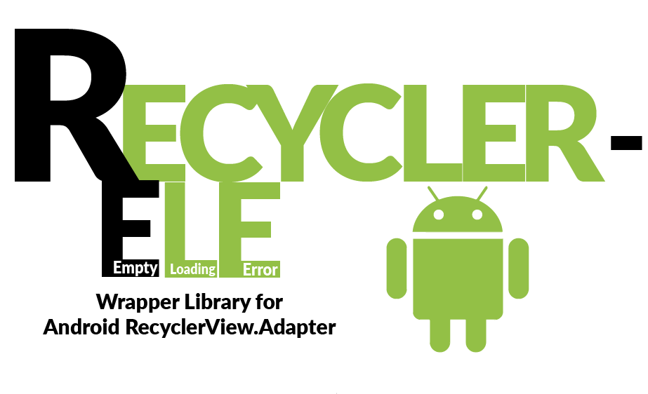

## Recycler ELE
-------------------------------------------
[  ](https://jitpack.io/#the-cybersapien/RecyclerELE)[  ](https://bintray.com/the-cybersapien/android-RecyclerELE/recycler-ele/_latestVersion)



Related Blog Post: [Cybersapien's blog](http://blog.cybersapien.xyz/android/libraries/recycler-ele-recyclerview/)

We often use the RecyclerView and the RecyclerView.Adapter for our material design apps. Going from the ListView to RecyclerView, I really missed the `setEmptyView()` method.

So, I extended the original RecyclerView Adapter to help manage different states in the application.
The Adapter, apart from the standard list, supports three different views:
* Loading View (While Data is being fetched)
* Empty View (When there is not data)
* Error View (In case of an error while fetching data)

This way, `RecyclerELE` helps us give different output to user depending on the current state of data, without having to mess a lot with the code.


### Installation

------------------------------------------

The installation is pretty easy.

#### JCenter

##### For Gradle
In your app module's `build.gradle` add dependency:
```
    compile 'com.github.the-cybersapien:recyclerELE:(latest release)'
```

##### For Maven:

Add Snippet:
```
<dependency>
  <groupId>com.github.the-cybersapien</groupId>
  <artifactId>recyclerELE</artifactId>
  <version>v1.1</version>
  <type>pom</type>
</dependency>
```

#### Jitpack Gradle
In your project's `build.gradle` at the end of the repositories, add:

```
allprojects {
    repositories {
        ...
        maven { url 'https://jitpack.io' }
    }
}
```

In your app module's `build.gradle` add dependency:
```
    compile 'com.github.the-cybersapien:recyclerELE:(latest release)'
```


### Usage
------------------------------------

In your Activity, create a regular RecyclerView.Adapter for your List Item
```
    RecyclerAdapter listAdapter = new RecyclerAdapter(Object... args);
```

Get the reference to your RecyclerView 
```
    RecyclerView recyclerView = (RecyclerView) findViewById(R.id.recycler_view);
```

Inflate your empty view, loading view and error view with the recyclerView as their parent programmatically. 
```
    View loadingView = getLayoutInflator().inflate(R.layout.view_loading, recyclerView, false);
    View emptyView = getLayoutInflator().inflate(R.layout.view_empty, recyclerView, false);
    View errorView = getLayoutInflator().inflate(R.layout.view_error, recyclerView, false);
```

Initialize the RecyclerELEAdapter with the RecyclerAdapter and the different Views
```
    RecyclerELEAdapter recyclerELEAdapter = new RecyclerELE(listAdapter, emptyView, loadingView, errorView);
```

Set the RecyclerELEAdapter to your recyclerView
```
    recyclerView.setAdapter(recyclerELEAdapter);
```

Change the current View type of the adapter with `setCurrentView()` function
```
    // Normal List View
    recyclerELEAdapter.setCurrentView(RecyclerELEAdapter.VIEW_NORMAL);
    
    // Empty View
    recyclerELEAdapter.setCurrentView(RecyclerELEAdapter.VIEW_EMPTY);
    
    // Loading View
    recyclerELEAdapter.setCurrentView(RecyclerELEAdapter.VIEW_LOADING);
    
    // Error View
    recyclerELEAdapter.setCurrentView(RecyclerELEAdapter.VIEW_ERROR);
```

For more details, see the Sample Application in `recyclerELE sample` module.

## License
----------------------------------

```
Copyright [2017] [Aditya Aggarwal]

Licensed under the Apache License, Version 2.0 (the "License"); you may not use this file except in compliance with the License. You may obtain a copy of the License at

    http://www.apache.org/licenses/LICENSE-2.0

Unless required by applicable law or agreed to in writing, software distributed under the License is distributed on an "AS IS" BASIS, WITHOUT WARRANTIES OR CONDITIONS OF ANY KIND, either express or implied. See the License for the specific language governing permissions and limitations under the License.

```
